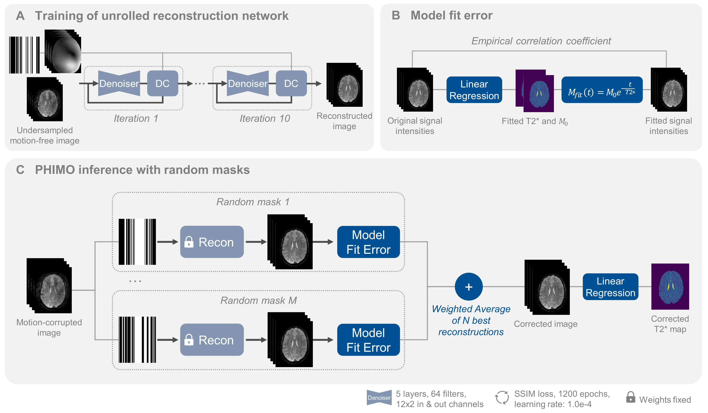

# PHIMO: Physics-Informed Motion Correction of GRE MRI for T2* Quantification

**Hannah Eichhorn**, Kerstin Hammernik, Veronika Spieker,  Elisa Saks, Kilian Weiss, Christine Preibisch, Julia A. Schnabel

- Accepted as oral at [ISMRM 2024](https://www.ismrm.org/24m/) | [abstract](https://submissions.mirasmart.com/ISMRM2024/Itinerary/PresentationDetail.aspx?evdid=2586)

- Extension accepted at MICCAI 2024 | find the repository [here](https://github.com/HannahEichhorn/PHIMO-miccai)


**Synopsis:** 
*Motivation:*  T2*-quantification from GRE-MRI is particularly impacted by subject motion due to its sensitivity to magnetic field inhomogeneities. The current multi-parametric quantitative BOLD motion correction method depends on additional k-space acquisition, extending overall acquisition times.
*Goal(s):* To develop a learning-based motion correction method tailored to T2*-quantification that avoids redundant data acquisition.
Approach: PHIMO leverages multi-echo T2*-decay information to identify motion-corrupted k-space lines and exclude them from a data-consistent deep learning reconstruction.
*Results:* We are able to correct motion artifacts in subjects with stronger motion, approaching the performance of the current motion correction method, while substantially reducing the acquisition time. 
*Impact:* PHIMO reduces strong motion artifacts in T2* maps by utilizing T2* decay information in an unrolled DL reconstruction. PHIMO avoids redundant data acquisition compared to a current correction method and reduces the acquisition time by over 40%, facilitating clinical applicability


## Citation
If you use this code, please cite our abstract:

```
@InProceedings{eichhorn2024ismrm,
      title={PHIMO: Physics-Informed Motion Correction of {GRE} {MRI} for {T2*} Quantification}, 
      author={Hannah Eichhorn and Kerstin Hammernik and Veronika Spieker and Elisa Sacks and Kilian Weiss and Christine Preibisch and Julia A. Schnabel},
      booktitle="Proceedings of the 2024 ISMRM & ISMRT Annual Meeting & Exhibition",
      year={2024},
}
```

## Contents of this repository:

- `iml-dl`: code belonging to the above work, using an adapted version of the [IML-CompAI Framework](https://github.com/compai-lab/iml-dl) and the [MERLIN Framework](https://github.com/midas-tum/merlin)

All computations were performed using Python 3.8.12 and PyTorch 2.0.1.


## Setup:

1. Create a virtual environment with the required packages:
    ```
    cd ${TARGET_DIR}/PHIMO
    conda env create -f conda_environment.yml
    source activate phimo *or* conda activate phimo
    ```

2. Install pytorch with cuda:
    ```
    conda install pytorch torchvision torchaudio pytorch-cuda=11.7 -c pytorch -c nvidia
    pip install torchinfo
    conda install -c conda-forge pytorch-lightning
    ```

3. For setting up wandb please refer to the [IML-CompAI Framework](https://github.com/compai-lab/iml-dl).


## Steps to reproduce the analysis:

1) Use the file `ismrm-abstract/iml-dl/projects/recon_t2star/preprocessing/create_symbolic_links.py` to create symbolic links under `ismrm-abstract/iml-dl/data/links_to_data/` (folders need to be adapted here).

2) Adapt `ismrm-abstract/iml-dl/projects/recon_t2star/configs/config_training.yaml` and `ismrm-abstract/iml-dl/projects/recon_t2star/configs/config_inference.yaml` to correct settings (i.e. input and output folders)

3) Run the following commands for training (reconstruction):
```
# go to right directory and activate the conda environment
cd path_to_code/PHIMO/ismrm-abstract/iml-dl
conda activate ismrm_2024

# launch the experiment
echo 'Starting Script'
python -u ./core/Main.py --config_path ./projects/recon_t2star/configs/config_training.yaml
```

4) Run the following commands for interference (motion correction):
```
# go to right directory and activate the conda environment
cd path_to_code/PHIMO/ismrm-abstract/iml-dl
conda activate ismrm_2024

# launch the experiment
echo 'Starting Script'
python -u ./core/Main.py --config_path ./projects/recon_t2star/configs/config_inference.yaml
```

5) For the evaluation of results and creation of plots for ISMRM abstract, adapt the config file `ismrm-abstract/iml-dl/projects/recon_t2star/configs/config_eval.yaml` and run `ismrm-abstract/iml-dl/projects/recon_t2star/evaluate_predictions.py`


## Illustration of PHIMO:

